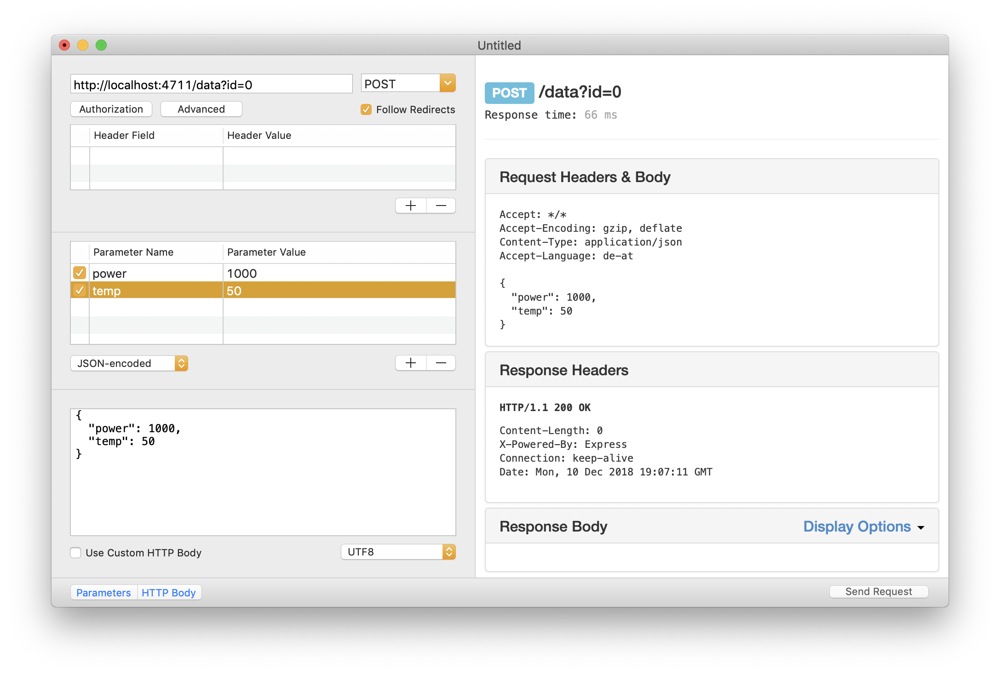

# Protokoll
  Berger Emil  
  5AHME, Gruppe 1  
  10.12.18  
  Anwesend: Berger, Böcksteiner, Bullner, Ehmann, Knappitsch, Kobor, Köhler  
  Abwesend: niemand  
  
## Wiederholung

### Installation von Modulen
  *Bsp: Installieren von express*
  * Befehl 1: `npm install express` -> Zum Installieren von express (es wird in der package.json eingetragen, welche Version benötigt wird.  
  * Befehl 2: `npm install --save-dev @types/express` -> Zum Installieren der TypeScript-Variante von Express, da diese aber nur zum Entwicklen benötigt wird, wird sie mit *--save-dev* in die Development-Module eingetragen.  
  
### Verwenden der HTTP-Requests in unserem Programm:

Request | Methode | Ressource | Funktion
------- | ------- | --------- | --------
GET | `this._server.get()` | `/data` & `/dataset` | Abrufen eines Wertes oder des Datensatzes
PUT | `this._server.put()` | `/data` | Hinzufügen eines Wertes
POST | `this._server.post()` | `/data` | Ändern eines Wertes
DELETE | `this._server.delete()` | `/data` | Löschen eines Wertes *(restliche Liste rückt im Index nach*)

### Collections in TypeScript

  Prinzipiell gibt es in TypeScript keine Collections wie in Java, da bereits in der Sprache vorhandene Elemente diese überflüssig machen. So gibt es zu vielen Java-Collections ein passendes Pendant.  

Java-Collection | JS/TS-Pendant
--------------- | -------------
Array-List | Array `x[]`
Hash-Map | Object

  Dies sind nur zwei Beispiele. Eine ArrayList lässt sich mit einem Array realisieren, da Arrays über ähnlich funktionierende Methoden verfügt wie eine ArrayList in Java.  
  Das Gleiche gilt für Hash-Maps.  

## REST-Server: DELETE (Löschen eines Wertes)
  *Um PUT, POST oder DELETE zu testen werden HTTP-Client-Tools wie [RESTed](https://itunes.apple.com/at/app/rested-simple-http-requests/id421879749?mt=12) benötigt!*

  Um einen Wert aus der Datenbank zu löschen muss man für die HTTP-Request *DELETE* eine Handler-Methode schreiben und diese im Constructor an den Server weitergeben.  
  Der Index *(id)* des Wertes, welcher gelöscht werden soll, wird in der URL mit **query** übergeben.  
  
  Im Contructor wird folgendes hinzugefügt:  
```typescript
this._server.delete('/data',
    (req, res) => this.handleDeleteData(req, res));
```

  Die dazugehörige Handler-Methode sieht so aus:  
```typescript
private handleDeleteData(req: express.Request, res: express.Response) {
    try {
        const id = +req.query.id;
        if (id >= 0 && id < Database.getInstance().size()) {
            Database.getInstance().remove(id);
            res.status(200).end();
        } else {
            throw new Error('invalid index ' + id);
        }
    } catch (err) {
        res.status(400).send('400 Bad Request');
    }
}
```
  Nun besteht allerdings noch das Problem, dass die weiter hinten in der Liste rangierenden Werte "nachrücken" und ihre ID ändern.  
  Eine bessere Realisierung wäre mit einem *Object* gewesen, das wie oben angeführt ähnlich wie eine *Hash-Map* funktioniert. So würde der Wert die ID behalten.  
  Eine zweite Möglichkeit wäre es unserem Objekt *Value* noch eine Variable *ID* hinzuzufügen, die nicht mehr geändert wird.  
  

## REST-Server: POST (Ändern eines Wertes)

  Bevor wir die Handler-Methode für *POST* schreiben, muss eine Methode `edit();` in unserer Datenbank erstellt werden.  
  Diese Methode muss entweder **beide** Werte austauschen, wenn beide im Body vorhanden sind oder auch nur **einen der beiden** (Power / Temperature).  
  In Java würde man dafür mehrere *gleichnamige Methoden* mit *unterschiedlicher Parameterliste* ertsellen. Dies ist in TypeScript aber nicht möglich, da ein TypeScript-Code immer in JavaScript transpiliert wird und JavaScript keine Datentypen kennt. JavaScript kann also diese Methoden nicht durch ihre Parameterliste unterscheiden, daher funktioniert das nicht.  
  
### [Signature Overloading](https://stackoverflow.com/questions/13212625/typescript-function-overloading)
  Eine Möglichkeit wäre das **Signature Overloading** in JavaScript. Im Prinzip erfüllt es die Funktion von *gleichnahmigen Methoden mit unterschiedlicher Parameterliste* in Java - mit einem anderen Syntax.  
  
  Dies wäre ein Beispiel, wie sich die Methode `edit()` mittels *Signature Overloading* realisieren lassen würde:  
```typescript
// Signature Overloading in TS
public edit (index: number, value: Value): void;
public edit (index: number, temp: number, power: number): void;
public edit (index: number, p2: any, power?: any): void {
    if (p2 instanceof Value) {
        this.data[index] = p2;
    } else if (typeof p2 === 'number' && typeof power === 'number') {
        this.data[index] = new Value(p2, power);
    } else if (typeof p2 === 'number' && typeof power === 'undefined') {
        this.data[index] = new Value(p2, this.getPower(index));
    } else if (typeof power === 'number' && typeof p2 === 'undefined') {
        this.data[index] = new Value(this.getTemp(index), power);
    }
}
```
  Die Methode berücksichtigt im Prinzip alle Parameter die in diesen Methoden deklariert sind und nutzt die, die beim Aufruf übergeben werden.  
  * Wenn ein **Value**-Objekt ankommt, wir direkt dieses als Wert am Index gesetzt.  
  * Wenn **zwei** Werte ankommen, wird ein neues Objekt aus diesen Werten gebaut.  
  * Wenn nur **ein** Wert ankommt wird für den anderen Wert der bereits vorhandene verwendet.  
  Da der dritte Parameter ja nicht da sein muss, muss der **Fragezeichen-Operator** (**?**) angeführt werden.  
  
  Zusätzlich werden in der Klasse *database* noch die Methoden `getPower()` und `getTemp()` benötigt:  
```typescript
public getPower (index: number): number {
    return this.data[index].power;
}

public getTemp (index: number): number {
    return this.data[index].temp;
}
```

### Zweite Variante
  
  Ich habe mich allerdings dazu entschlossen dies anders zu lösen. Da JavaScript die Datentypen egal sind, kann man in der Deklaration einfach *any* eintragen und jeder Datentyp wird akzeptiert. Dann wird geprüft welche Datentypen die übergebenen Variablen haben und je nach dem wird weiter vorgegangen:  
```typescript
public edit (index: number, temp: any, power: any): void {
    if (typeof temp === 'number' && typeof power === 'number') {
        this.data[index] = new Value(temp, power);
    } else if (typeof temp === 'number' && typeof power === 'undefined') {
        this.data[index] = new Value(temp, this.getPower(index));
    } else if (typeof power === 'number' && typeof temp === 'undefined') {
        this.data[index] = new Value(this.getTemp(index), power);
    }
}
```
  *Mit **typeof** wird abgefragt um welchen Datentyp es sich handelt*
  * Wenn **beide** *number* sind -> beide Werte werden verändert  
  * Wenn **temp** *number* ist -> temp wird geändert, bei power wird der alte Wert beibehalten (getPower())  
  * Wenn **power** *number* ist -> power wird geändert, bei temp wird der alte Wert beibehalten

### Handler-Methode

  Im Contructor:  
```typescript
this._server.post('/data',
    (req, res) => this.handlePostData(req, res));
``` 

  Die dazugehörige Handler-Methode:  
```typescript
private handlePostData(req: express.Request, res: express.Response) {
    try {
        const id = +req.query.id;
        const power = req.body.power;
        const temp = req.body.temp;
        if (id >= 0 && id < Database.getInstance().size()) {
            try {
                Database.getInstance().edit(id, temp, power);
                res.status(200).end();
            } catch (err) {
                res.status(500).send('500 Server Error');
            }
        } else {
            throw new Error('invalid index ' + id);
        }
    } catch {
        res.status(400).send('400 Bad request');
    }
}
```
  Über die **query** wird in der URL die *ID* abgefragt, die zu verändernden Werte befinden sich im Body als *JSON* codiert.  
  Auch wenn einer dieser beiden Parameter nicht vorhanden sein sollte, wird einfach **undefined** übergeben und die Methode `edit();` erkennt dies.  
  Das zusätzliche *try-catch* innerhalb der Plausibilitätsüberprüfung der ID ist dazu da um interne Serverfehler, für die der Client nichts kann, nicht als *"400 Bad request"* auszugeben.  
  Sollte ein falscher Index eingegeben werden, wird dieser als neuer *Error* geworfen, am Schluss abgefangen und als *"400 Bad request"* zurückgeschickt.  

### Testen von POST

  Da wir - zumindest nicht alle - in der Unterrichtseinheit mit der Methode *POST* fertig geworden sind, lag es an uns die Funktionalität auszutesten:  
  
#### Ausgangszustand (via GET /dataset)
```json
[{"time":"2018-12-10T19:11:02.486Z","temp":23.4,"tempUnit":"°C","power":100,"powerUnit":"W"},
{"time":"2018-12-10T19:11:02.486Z","temp":23.5,"tempUnit":"°C","power":120,"powerUnit":"W"},
{"time":"2018-12-10T19:11:02.486Z","temp":23.6,"tempUnit":"°C","power":150,"powerUnit":"W"},
{"time":"2018-12-10T19:11:02.486Z","temp":23.7,"tempUnit":"°C","power":200,"powerUnit":"W"}]
```

#### Ändern von beiden Werten
  **Request:**  
  
  **Response:**  
```json
[{"time":"2018-12-10T19:07:11.529Z","temp":50,"tempUnit":"°C","power":1000,"powerUnit":"W"},
{"time":"2018-12-10T19:07:11.529Z","temp":23.5,"tempUnit":"°C","power":120,"powerUnit":"W"},
{"time":"2018-12-10T19:07:11.529Z","temp":23.6,"tempUnit":"°C","power":150,"powerUnit":"W"},
{"time":"2018-12-10T19:07:11.529Z","temp":23.7,"tempUnit":"°C","power":200,"powerUnit":"W"}]
```

#### Ändern eines Wertes 
  **Request:**  
    
  **Response:**  
```json
[{"time":"2018-12-10T19:11:44.008Z","temp":50,"tempUnit":"°C","power":2000,"powerUnit":"W"},
{"time":"2018-12-10T19:11:02.486Z","temp":23.5,"tempUnit":"°C","power":120,"powerUnit":"W"},
{"time":"2018-12-10T19:11:02.486Z","temp":23.6,"tempUnit":"°C","power":150,"powerUnit":"W"},
{"time":"2018-12-10T19:11:02.486Z","temp":23.7,"tempUnit":"°C","power":200,"powerUnit":"W"}]
```

#### Zusammenfassung
Alles funktioniert einwandfrei! (Und wie oft kann man das über ein Programm sagen...)
