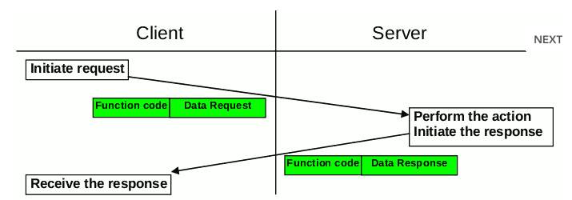

# Protokoll
## Thema: Verbindung zwischen einem Entwicklerboard und ein Programm am Pc

Name: Platzer Andreas  
Datum: 13.02.2018  
Gruppe: 2  
Anwesend: Platzer Andreas, Muri Lorenz, Nebel Florian, Mandl Gerhard, Moritz Martinak, Mario Nabernik, Marcel Köhler  
Abwesend: Michael Mörth  
Abgabe Datum: 27.02.2018  

# Aufbau:
Die Aufgabenstellung war es mit Hilfe eines Sure-Board die Temperatur zu messen und mithilfe einer Schnittstelle an den Computer zu senden. In dieser Einheit ging es hauptsächlich darum eine Schnittstelle auszuwählen und ein Kommunikationsprotokoll zu installieren.

## Feldbusprotokolle 
Um eine Schnittstelle benutzen zu können muss diese mit einem Protokoll versehen werden. Für unsere Anwendung würde es einige dieser Feldbus Systeme geben wie z.B. Powerlink (B&R), Profinet (PROFIBUS) oder Flexray. Da diese allerdings wegen der Lizenzen nicht genutzt werden können sind wir auf den genauso guten System „Modbus“ ausgewichen.

## Modbus

> Das Modbus-Protokoll ist ein Kommunikationsprotokoll, das auf einer Master/Slave- bzw. Client/Server-Architektur basiert. Es wurde 1979 von Gould-Modicon für die Kommunikation mit seinen speicherprogrammierbaren Steuerungen ins Leben gerufen. In der Industrie hat sich der Modbus zu einem De-facto-Standard entwickelt, da es sich um ein offenes Protokoll handelt. Seit 2007 ist die Version Modbus TCP Teil der Norm IEC 61158. 

Quelle: [https://de.wikipedia.org/wiki/Modbus](https://de.wikipedia.org/wiki/Modbus)

## Aufbau:

Genauer eingegangen heißt es das die Entwickler ein einfaches zustandsloses Protokoll entwickeln wollten das aus 7 Layern besteht. (siehe Bild) 
Durch die verwendung von UART oder TCP/IP hat die Verwendung von Modebus große Vorteile. 
Grundsätzlich kann man sagen das die Datenübertragung über drei verschidenen Varianten ausgeübt wird.

|  Datenübertragung  | Beschreibung |
|:------:|:------------:|
| Modbus ASCII | Rein textuelle byteweise Übertragung von Daten. Frames beginnen mit einem Doppelpunkt. |
| Modbus RTU (Remote Terminal Unit) | Binäre byteweise Übertragung von Daten.|
| Modbus TCP | Übertragung der Daten in TCP Paketen |

### Kommunikation

Die Kommunikation besteht aus einem Server -Client Prinzip. Wenn der Client Informationen braucht sendet er ein Request zum Server, anschließend wird dieses vom Server empfangen und die daten werden zurück übermittelt.In der unteren Bild wird dieses Verfahren in Form einer Skizze abgebildet.

