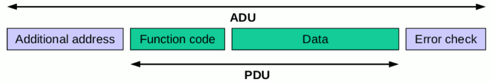

# Protokoll
## Thema: Verbindung zwischen einem Entwicklerboard und ein Programm am Pc

Name: Platzer Andreas  
Datum: 13.02.2018  
Gruppe: 2  
Anwesend: Platzer Andreas, Muri Lorenz, Mandl Gerhard, Moritz Martinak, Marcel Köhler  
Abwesend: Michael Mörth, Mario Nabernik, Marcel Köhler, Mario Nabernik, Nebel Florian 
Abgabe Datum: 27.02.2018  

# Aufbau:
Die Aufgabenstellung war es mit Hilfe eines Sure-Board die Temperatur zu messen und mithilfe einer Schnittstelle an den Computer zu senden. In dieser Einheit ging es hauptsächlich darum eine Schnittstelle auszuwählen und ein Kommunikationsprotokoll zu installieren.

## Feldbusprotokolle 
Um eine Schnittstelle benutzen zu können muss diese mit einem Protokoll versehen werden. Für unsere Anwendung würde es einige dieser Feldbus Systeme geben wie z.B. Powerlink (B&R), Profinet (PROFIBUS) oder Flexray. Da diese allerdings wegen der Lizenzen nicht genutzt werden können sind wir auf den genauso guten System „Modbus“ ausgewichen.

## Modbus

> Das Modbus-Protokoll ist ein Kommunikationsprotokoll, das auf einer Master/Slave- bzw. Client/Server-Architektur basiert. Es wurde 1979 von Gould-Modicon für die Kommunikation mit seinen speicherprogrammierbaren Steuerungen ins Leben gerufen. In der Industrie hat sich der Modbus zu einem De-facto-Standard entwickelt, da es sich um ein offenes Protokoll handelt. Seit 2007 ist die Version Modbus TCP Teil der Norm IEC 61158. 

## Protokollaufbau:
Genauer eingegangen heißt es das die Entwickler ein einfaches zustandsloses Protokoll entwickeln wollten das aus 7 Layern besteht. (siehe Bild) 
Durch die verwendung von UART oder TCP/IP hat die Verwendung von Modebus große Vorteile. 
Grundsätzlich kann man sagen das die Datenübertragung über drei verschidenen Varianten ausgeübt wird.

|  Datenübertragung  | Beschreibung |
|:------:|:------------:|
| Modbus RTU (Remote Terminal Unit) | Binäre byteweise Übertragung von Daten.|
| Modbus ASCII | byteweise Übertragung, textuell|
| Modbus TCP | Übertragung der Daten in TCP Paketen |

#### RTU
> Im RTU-Modus wird der Sendebeginn durch eine Sendepause von mindestens der 3,5-fachen Zeichenlänge markiert. Die Länge der Sendepause hängt somit von der Übertragungsgeschwindigkeit ab. Das Adressfeld besteht aus acht Bit, die die Empfängeradresse darstellen. Der Slave sendet bei seiner Antwort an den Master ebendiese Adresse zurück, damit der Master die Antwort zuordnen kann. Das Funktionsfeld besteht aus 8 Bit. Hat der Slave die Anfrage des Masters korrekt empfangen, so antwortet er mit demselben Funktionscode. Ist ein Fehler aufgetreten, so verändert er den Funktionscode, indem er das höchstwertige Bit des Funktionsfeldes auf 1 setzt. Das Datenfeld enthält Hinweise, welche Register der Slave auslesen soll, und ab welcher Adresse diese beginnen. Der Slave setzt dort die ausgelesenen Daten (z. B. Messwerte) ein, um sie an den Master zu senden. Im Fehlerfall wird dort ein Fehlercode übertragen. Das Feld für die Prüfsumme, die mittels CRC ermittelt wird, beträgt 16 Bit. Das gesamte Telegramm muss in einem kontinuierlichen Datenstrom übertragen werden. Tritt zwischen zwei Zeichen eine Sendeunterbrechung auf, die länger als 1,5 Zeichen ist, so ist das Telegramm als unvollständig zu bewerten und sollte vom Empfänger verworfen werden.

#### ASCII
> Im ASCII-Modus beginnen Nachrichten mit einem vorangestellten Doppelpunkt, das Ende der Nachricht wird durch die Zeichenfolge Carriage return – Line feed (CRLF) markiert.

> Die ersten zwei Bytes enthalten zwei ASCII-Zeichen, die die Adresse des Empfängers darstellen. Der auszuführende Befehl ist auf den nächsten zwei Bytes codiert. Über ein Zeichen folgen die Daten. Über das gesamte Telegramm (ohne Start- und Ende-Markierung) wird zur Fehlerprüfung ein LRC ausgeführt, dessen Paritätsdatenwort in den abschließenden zwei Zeichen untergebracht wird. Tritt während der Übertragung eines Frames eine Pause von > 1s auf, wird der Frame als Fehlerfall bewertet. Der Benutzer kann ein längeres Timeout konfigurieren.

#### TCP/IP
| Transaktionsnummer | Protokollkennzeichen | Zahl der nachfolgenden Bytes | Adresse | Funktion | Daten |
|:------------------:|:--------------------:|:----------------------------:|:-------:|:--------:|:-----:|
| 2 Byte | 2 Byte (immer 0x0000) | 2 Byte | 1 Byte | 1 Byte | n Byte |

Quelle: [https://de.wikipedia.org/wiki/Modbus](https://de.wikipedia.org/wiki/Modbus)

### Kommunikation

Die Kommunikation besteht aus einem Server -Client Prinzip. Wenn der Client Informationen braucht sendet er ein Request zum Server, anschließend wird dieses vom Server empfangen und die daten werden zurück übermittelt.In der unteren Bild wird dieses Verfahren in Form einer Skizze abgebildet.

### Objekttypen

| Schnittstellentyp | Objekttyp | Zugriff |
|:-----------------:|:---------:|:-------:|
| Digitaler Eingang | "Discrete Input" | kann nur gelesen werde |
| Analoger Eingang | "Input Register" | kann nur gelesen werden |
| Digitaler Ein und Ausgang | "Coil" | kann gelesen und geschreiben werden |
| Analoger Ein und Ausgang | "Holding Register" | kann gelesen und geschreiben werden |

### Wegfindung bei mehreren Servern

Wenn mehrere Server verwendet werden( z.B. mehrere Temperatur Sensoren) müssen diese verschiedene Adressen besitzen. Die Verbindung besteht jetzt aus ADU Paketen, die aus der Additional address, den Function code, die Daten, und den error check bestehen.

