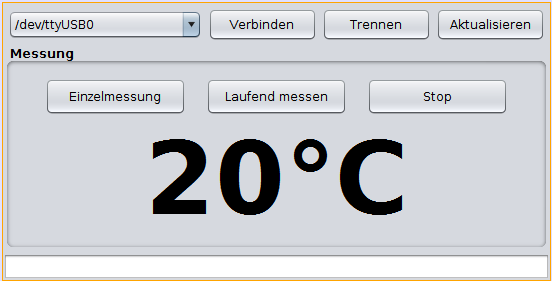

# Protokoll
## Thema: Entwicklung eines Programmes zur Messung der Temperatur

Name: Platzer Andreas <br>
Datum: 20.02.2018 <br>
Gruppe: 2 <br>
Anwesend: Platzer Andreas, Muri Lorenz, Mandl Gerhard, Moritz Martinak, Marcel Köhler, Michael Mörth, Mario Nabernik, Marcel Köhler, 
Mario Nabernik, Nebel Florian <br>
Abwesend:-<br>
Abgabe Datum: 23.04.2018 <br>


### Aufgabenstellung

In der folgenden Aufgabe wurden musste das Grundwissen das wir uns zuvor angeeignet haben miteinbezogen werden damit alle Funktionen des Programmes funktionieren. Es musste ein Programm geschrieben werden das die Daten des SureBoards über den Mode Bus den wir zuvor installiert haben ausließt und dies auf einer grafischen Oberfläche ausgibt.


### Das Programm
In den Folgenden Teilen des Programmes wird jeweils die Grund Aufgabe kurz erklärt und anschließend im Quellcode näher erläutert. 


#### GUI Vorlage
Aufbau und Ablauf der GUI Vorlage 
Die GUI Vorlage wurde uns vorgegeben. 
Links oben kann das Port im Falle das es eines oder mehrere gibt ausgewählt werden. Dieses soll sofern es keine Schnittstelle gibt abbleichen und nicht aktiv sein. 
Der Klopf Verbinden muss im falle eines offenen Ports aktiviert sein und darf bei einer aktiven Verbindung grau hinterlegt sein.
Trennen darf nur dann aktiv sein, wenn eine aktive Verbindung besteht. Wenn diese unterbrochen wird, wird auch der Knopf inaktiv.
Der Knopf Aktualisieren kann immer gedrückt werden und ist für die Aktualisierung der Schnittstellen zuständig. <br>



#### SureModebusGui()
Im Konstruktor wird das Fenster mittig geöffnet und die Temperatur auf Fragezeichen gesetzt solange keine Temperatur vorhanden ist.
Als letztes wurde noch die Methode refresh() aufgerufen.

```java
public SureModbusGui () {
    initComponents();
    setLocationRelativeTo(null);    // Mittige ausgabe des Fensters
    jlaTemperatur.setText("? °C");  // Da die Temperatur zuerst nicht bekannt ist wird ein Fragezeichen ausgegeben 
    refresh();                      // Anschlüsse werden aktualisiert 
  }
```


#### updateSwingControls()
Im Swing Control Teil wird der Ablauf des Control Fenster gemanagt.
Im Ersten Teil werden alle Controls deaktiviert.
Im zweiten Teil werden die Fenster je nach Zustand schlussendlich aktiviert.

```java
public void updateSwingControls ()
  {
    jcbSerialDevice.setEnabled(false);                  // Alle Knöpfe werden zuerst deaktiviert
    jbutConnect.setEnabled(false);
    jbutDisconnect.setEnabled(false);
    jbutRefresh.setEnabled(false);
    jbutSingleMeasurement.setEnabled(false);
    jbutContinousMeasurement.setEnabled(false);
    jbutStopMeasurement.setEnabled(false);
    
    if(serialPort != null && serialPort.isOpened())     // Wenn ein port erkannt wurde und der Port geöffnet ist
    {
      jbutDisconnect.setEnabled(true);                  // wird der Button Trennen wieder aktiviert
      return;
    }
    
    if(ports == null || ports.length == 0)              // Wenn kein Port erkannt wird der Aktualierungs Knopf aktiviert.
    
    {
      jbutRefresh.setEnabled(true);                     
    }
    
    if(ports != null && ports.length > 0)               //  Wenn ein Port erkannt wird werden folgende Knöpfe aktiviert.
    {
      jcbSerialDevice.setEnabled(true);                 // Combobox wird aktiviert.
      jbutConnect.setEnabled(true);                     // Verbindungs Button wird aktiviert.
      jbutRefresh.setEnabled(true);                     // Aktualisiereungs Button wird aktiviert.
    }
  }
```


#### refresh()
In der Methode refresh() geht es darum die aktiven Anschlüsse herauszufinden und anschließend diese in das updateSwingControls() zu übergeben und zu aktualisieren.
```java
private void refrehPorts () {
    ports = jssc.SerialPortList.getPortNames();                                 // Der Portname wird in ports geschrieben.
    System.out.println(ports);                                                  // Gibt das ausgewählte ports aus.
    DefaultComboBoxModel <String> model = new DefaultComboBoxModel (ports)      // Ein neues Model wird erzeugt.
    jcbSerialDevice.setModel(model);                                            // Das neue Model wird gesetz.
    
    updateSwingControls();                                                      // Die Methode wird zur Aktualisierung aufgerufen.
    
  }
```

#### connenct()
In dieser Methode wird der ausgewählte Port Name übergeben und anschließend geöffnet
Im Falle eines Fehlers wird eine Fehlermeldung ausgegeben.
```java
private void connect ()
  {
    try                                                                             
    {
    String port = (String)jcbSerialDevice.getSelectedItem();                            // Die ausgewählt Verbindung wird zugewiesen.
    serialPort = new jssc.SerialPort(port);                                             // Port wird zugewiesen. 
    serialPort.openPort();                                                              // Das Port wird geöffnet
    }
    catch(Throwable th)
    {
      showThrowable("Serielle Schnittstelle kann nicht geöffnet werden!", th);          // Im Falle eines Fehlers wird showThrowable() aufgerufen.
    }
  }

```

#### disconnect()
Wenn die Schnittstelle geschlossen werden soll wird die Methode disconnect() aufgerufen.
Auch diese hat im Falle eines Fehlers eine Fehlermeldung enthalten. Wenn die Schnittstelle erfolgreich getrennt wurde wird noch einmal die die updateSwingContols () Methode aufgerufen um das Fenster zu aktualisieren.
```java
private void disconnect()
  {
    try                                                                    
    {
      serialPort.closePort();                                               // Das Port wird geschlossen.
    }
    catch (Throwable th)
    {
      showThrowable("Schnittstelle kann nicht getrennt werden", th);        //  Im Falle eines Fehlers wird showThrowable() aufgerufen.
    }
    finally
    {
      serialPort = null;                                                    // Das port wird auf null gesetzt.
      updateSwingControls();                                                // Die Methode updateSwingControls() wird zur aktualisierung aufgerufen.
    }
  }
```

#### actionPerformed () 
Damit das Programm auch funktioniert müssen die Aktion Events auf mit dem Programm verknüpft werden. Dies geschieht mit den 3 ActionPeformer.
```java
private void jbutConnectActionPerformed(java.awt.event.ActionEvent evt)                                            
  {                                                
    connect ();                                                               // Diee Methode connect() wird aufgerufen.
  } 
  
  private void jbutRefreshActionPerformed(java.awt.event.ActionEvent evt)                                            
  {                                                
    refresh();                                                                // Die Methode refresh()  wird aufgerufen.
  }                                           

  private void jbutDisconnectActionPerformed(java.awt.event.ActionEvent evt)                                               
  {                                                   
    disconnect();                                                             // Die Methode disconnect() wird aufgerufen
  }                                              

```


### Fertigstellung des Programms 

In dieser Einheit wurde das Programm-Grundgerüst programmiert und das Sureboard für die Datenübertragung vorbereitet. In den folgenden Einheiten werden wir diese Programm fertigstellen.


